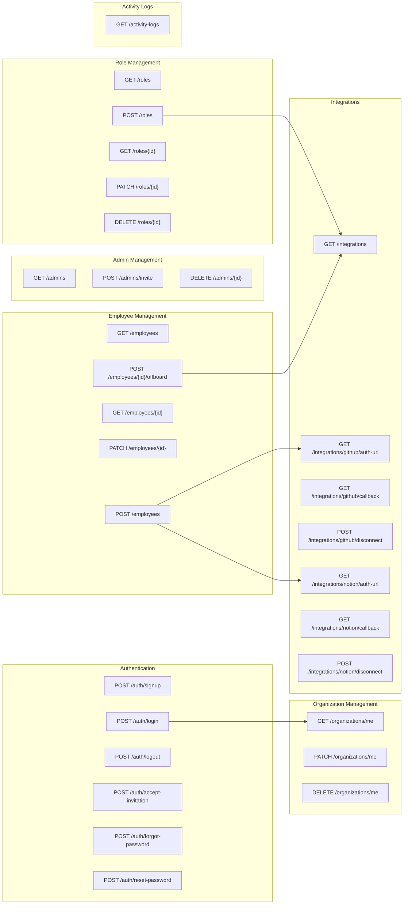

# API Overview Diagram

## Endpoint Summary

| Category | Endpoints | Auth Required | Owner Only |
|---|---|---|---|
| Auth | 6 | Varies | No |
| Organization | 3 | Yes | Update/Delete |
| Admins | 3 | Yes | Yes |
| Integrations | 7 | Yes | No |
| Roles | 5 | Yes | No |
| Employees | 5 | Yes | No |
| Activity Logs | 1 | Yes | No |
| **Total** | **30** | | |

## Authentication Requirements

| Endpoint Category | Auth Requirement | Notes |
|---|---|---|
| POST /auth/signup | Public | Creates org + owner |
| POST /auth/login | Public | Rate limited |
| POST /auth/logout | Authenticated | — |
| POST /auth/accept-invitation | Token | Valid invitation token |
| POST /auth/forgot-password | Public | Rate limited |
| POST /auth/reset-password | Token | Valid reset token |
| All other endpoints | Authenticated | Session required |

## Common Query Parameters

| Parameter | Type | Used By |
|---|---|---|
| `page` | integer (default: 1) | All list endpoints |
| `per_page` | integer (default: 20, max: 100) | All list endpoints |
| `search` | string | GET /employees |
| `status` | string | GET /employees |
| `role_id` | UUID | GET /employees |
| `action` | string | GET /activity-logs |
| `date_from` | ISO datetime | GET /activity-logs |
| `date_to` | ISO datetime | GET /activity-logs |
| `actor_id` | UUID | GET /activity-logs |
