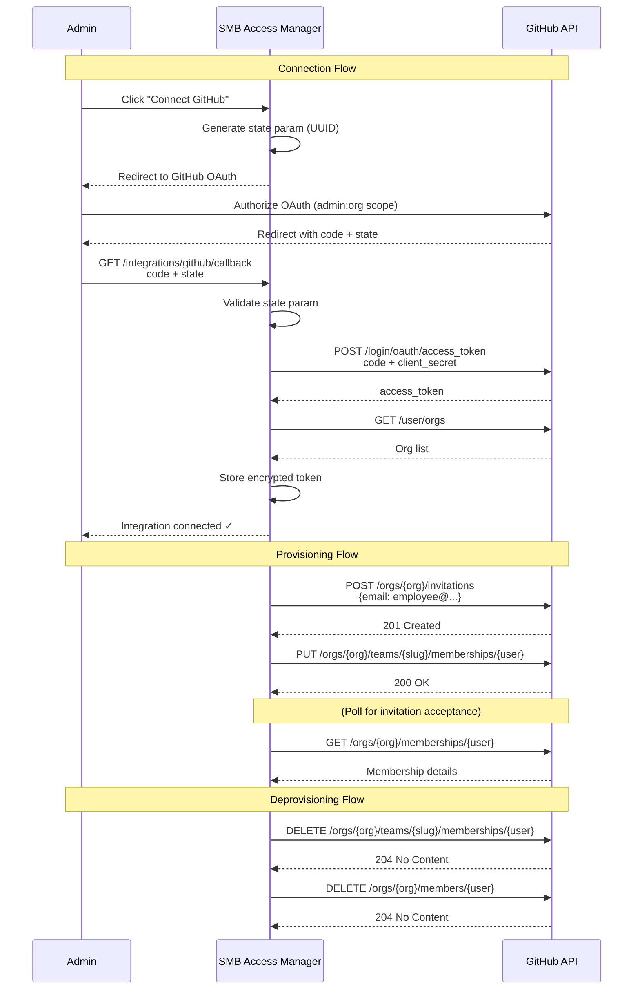

# GitHub Integration Sync Flow

## Key Details

| Aspect | Implementation |
|---|---|
| OAuth Scopes | `admin:org` — manage org membership and teams |
| Token Storage | Fernet-encrypted at rest, decrypted in memory for API calls |
| Rate Limits | 5,000 req/hr authenticated; monitor X-RateLimit-Remaining header |
| Retry Strategy | 429: wait for reset; 5xx: exponential backoff (1s, 2s, 4s) |
| Idempotency | Re-inviting existing member returns 422 → treated as success |
