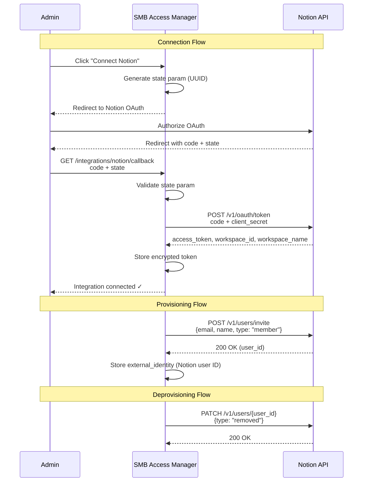

# Notion Integration Sync Flow

## Key Details

| Aspect | Implementation |
|---|---|
| OAuth Capabilities | `read:user`, `read:workspace`, `write:user` |
| Token Lifespan | Notion tokens do not expire — no refresh flow needed |
| Token Storage | Fernet-encrypted at rest |
| Rate Limits | 3 req/sec per integration; token bucket throttling |
| Retry Strategy | 429: respect Retry-After header; 5xx: exponential backoff (1s, 2s, 4s) |
| Idempotency | Re-inviting existing member returns success (idempotent) |
| User Removal | Notion sets user type to "removed" — data remains orphaned |
