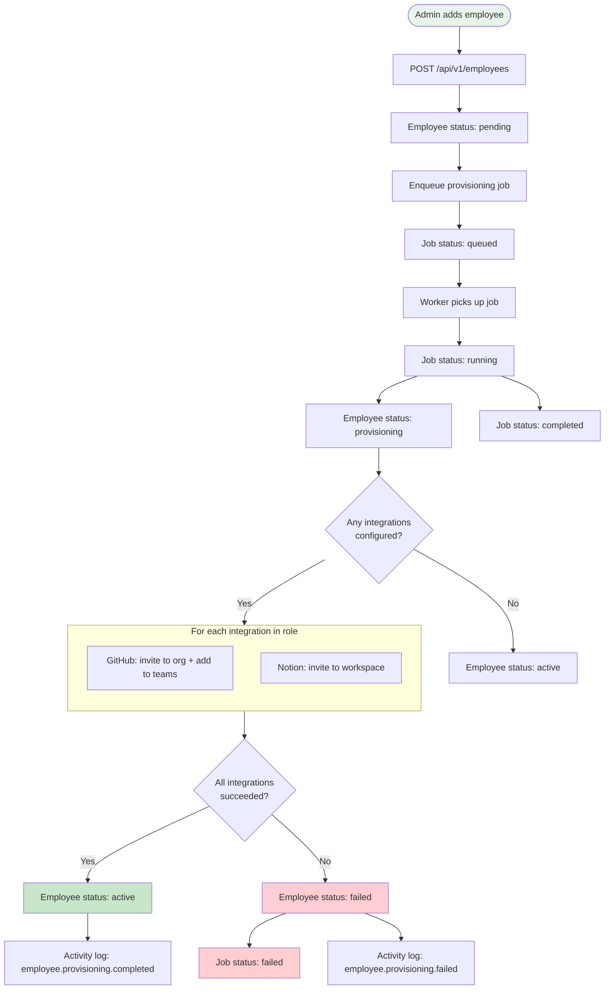

# Onboarding Flow Diagram

## Key Decisions

| Decision | Rationale |
|---|---|
| Serialized per employee | Prevents race conditions from rapid role changes |
| Retry up to 3 times | Transient failures (rate limit, network) are common |
| Partial success handled | One integration failing shouldn't affect others |
| Status polling via HTMX | Real-time feedback without WebSocket complexity |
