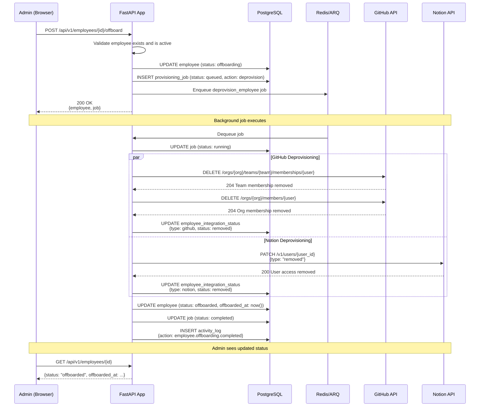

# Offboarding Sequence Diagram



## GitHub Deprovisioning Details

```
Step 1: Remove from teams
  DELETE /orgs/{org}/teams/{engineering}/memberships/{username}
  → 204: Removed successfully
  → 404: Not a member (treat as success)

Step 2: Remove from organization
  DELETE /orgs/{org}/members/{username}
  → 204: Removed successfully
  → 404: Not a member (treat as success)
```

## Edge Case Handling

| Scenario | Behavior |
|---|---|
| Employee not fully provisioned | Skip integration steps, mark as offboarded |
| Integration disconnected | Skip that integration, continue others |
| Employee already removed from GitHub | 404 → treated as success (idempotent) |
| GitHub account deleted | 404 → treated as success |
| Notion user already removed | PATCH succeeds → treated as success |
| Network timeout | Retry with backoff, eventually fail with clear error |
