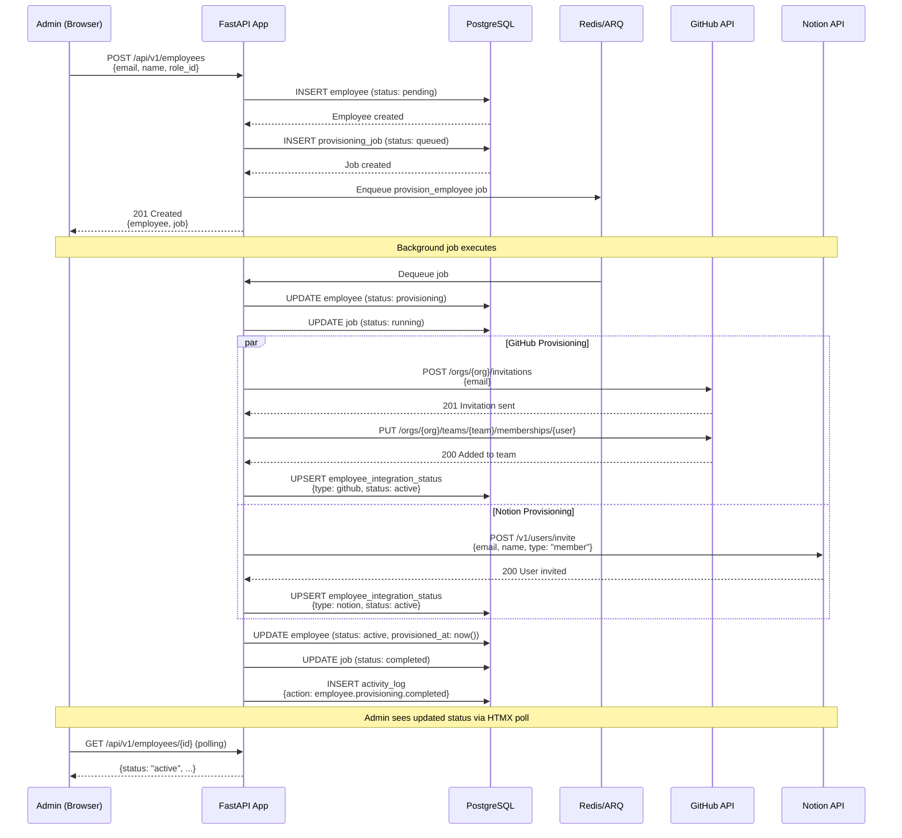

# Onboarding Sequence Diagram

## Timing

| Step | Expected Duration |
|---|---|
| API request | <100ms |
| Job enqueue | <10ms |
| GitHub provisioning | 5–30s (depends on invitation acceptance) |
| Notion provisioning | 2–10s |
| Total | <60s |

## Error Handling

| Failure Point | Action |
|---|---|
| GitHub invitation fails | Retry (3x), then mark GitHub as failed, continue with Notion |
| Notion invitation fails | Retry (3x), then mark Notion as failed |
| Both fail | Employee status: failed; admin notified |
| Database error during job | Job retried (DB may have recovered) |
