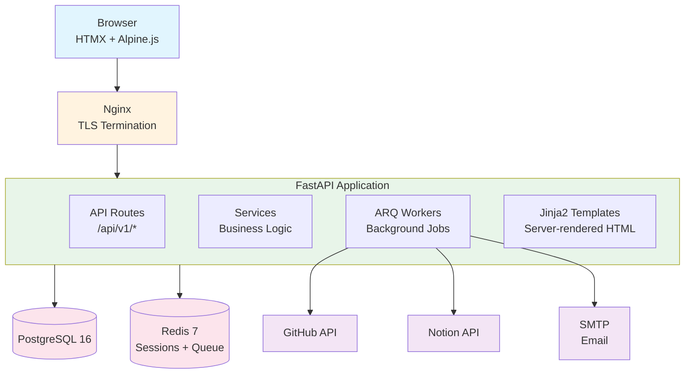

# System Architecture Diagram

## Component Descriptions

| Component | Role | Technology |
|---|---|---|
| Browser | User interface | HTML + HTMX + Alpine.js + Tailwind CSS |
| Nginx | Reverse proxy, TLS termination, static file serving | Nginx 1.24+ |
| FastAPI App | API server, template rendering, business logic | Python 3.12+ / FastAPI |
| PostgreSQL | Primary data store | PostgreSQL 16 |
| Redis | Session cache, job queue | Redis 7 |
| ARQ Workers | Background provisioning/deprovisioning | Python ARQ |
| GitHub API | External integration | REST API |
| Notion API | External integration | REST API |
| SMTP | Email sending | External mail provider |
